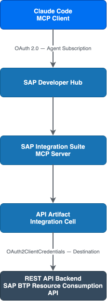
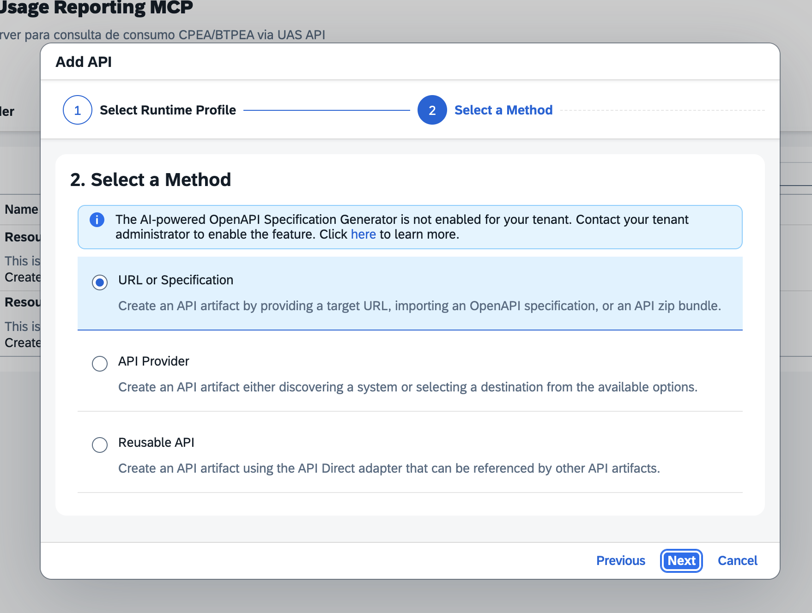
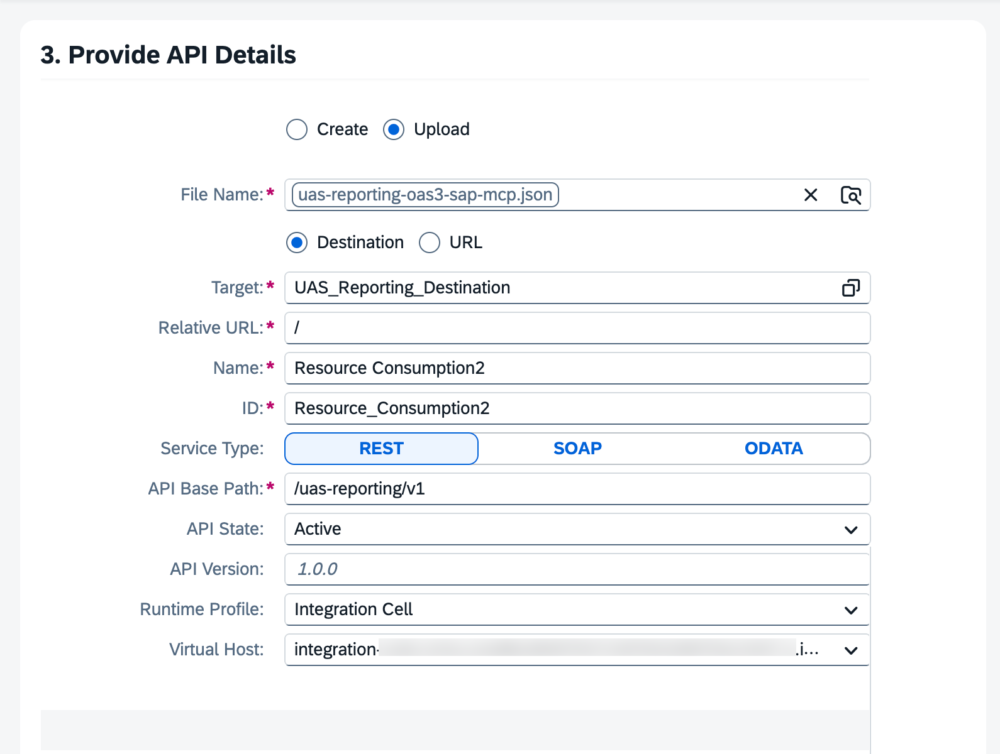
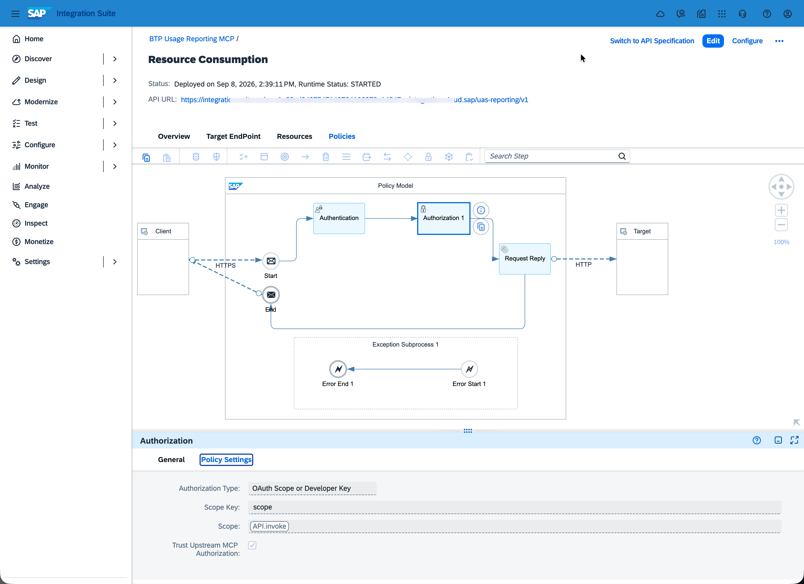
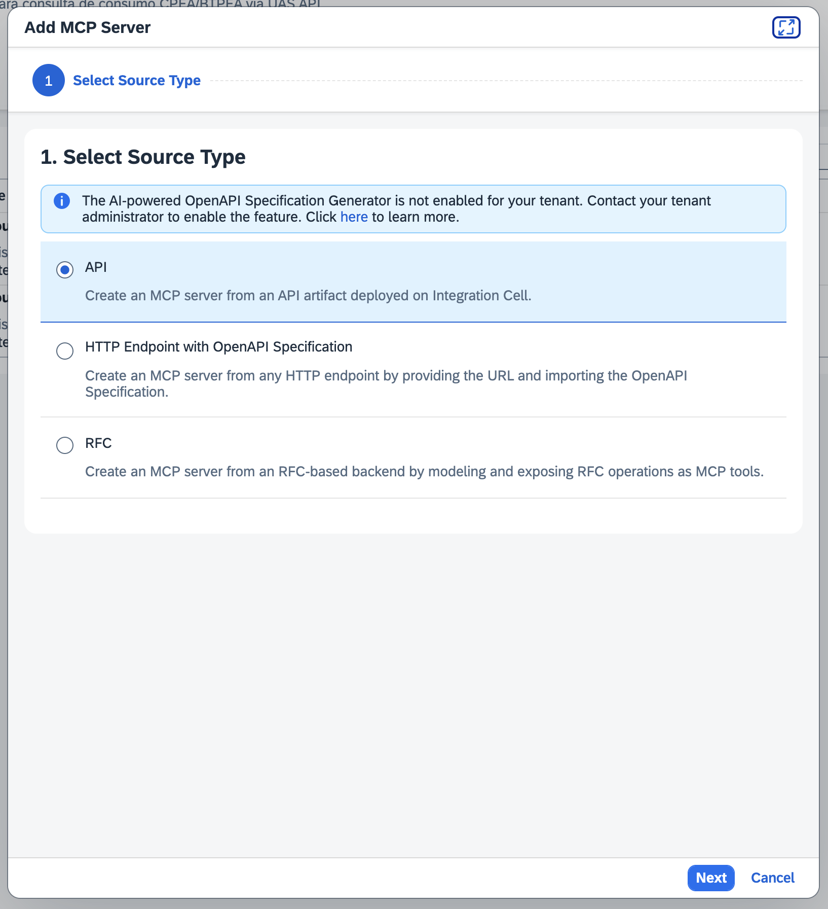
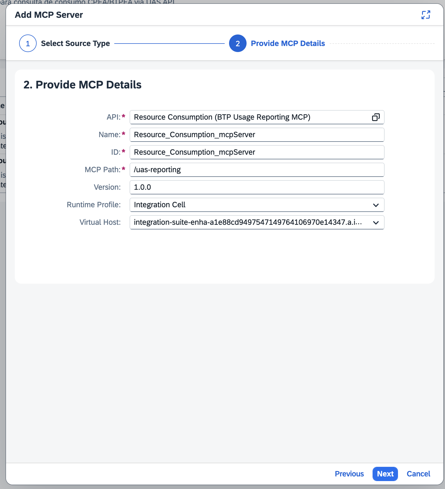
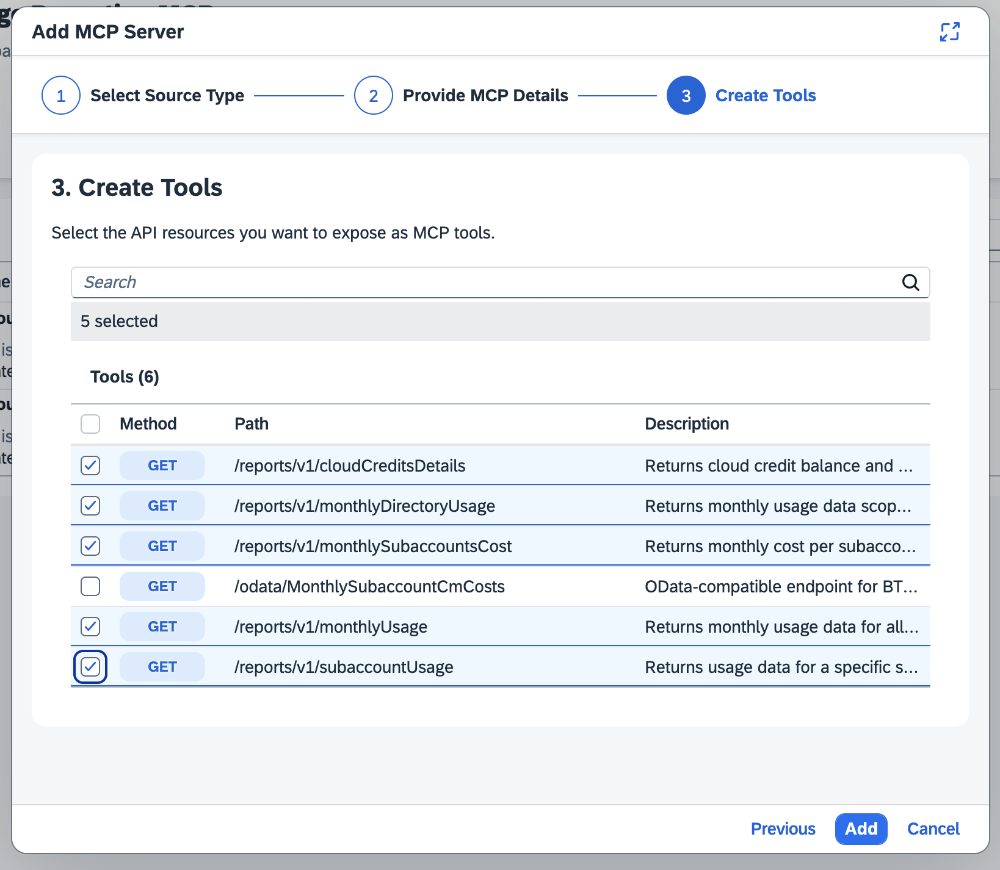
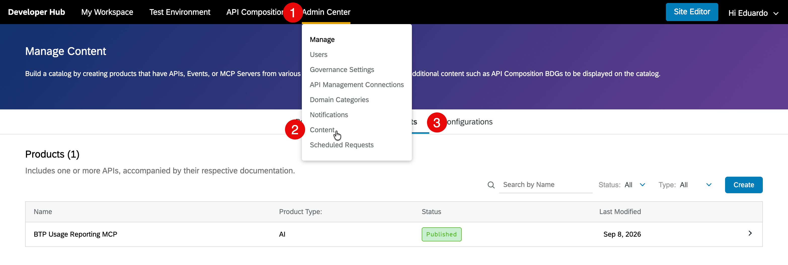
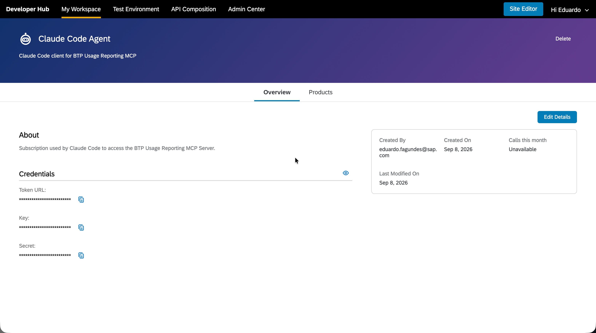
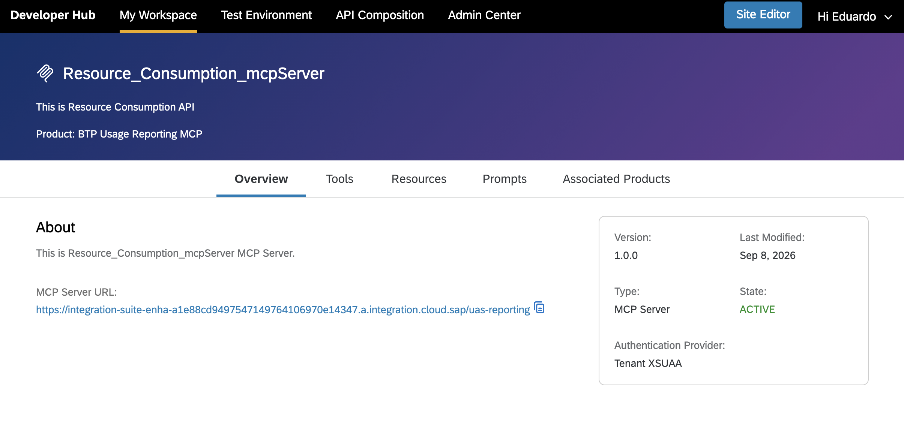

# SAP Integration Suite — MCP Server for BTP Resource Consumption

Companion resources for the SAP Community blog post:
**[From REST API to Claude Code: Building a Governed MCP Server with SAP Integration Suite](https://community.sap.com)**

---

## What's in this folder

| File | Purpose |
|---|---|
| `destination.properties` | Ready-to-import BTP Destination config for the UAS Reporting API |
| `uas-reporting-oas3-sap-mcp-blog.json` | OpenAPI 3.0.3 spec to upload into the Integration Suite API Artifact |
| `test-mcp.sh` | Shell script to validate the MCP Server manually via curl |
| `assets/architecture-diagram.svg` | Visual diagram of the MCP Server architecture and OAuth flow |
| `.env.example` | Configuration template — copy to `.env` and fill in your values |
| `.gitignore` | Git ignore rules (protects `.env` from being committed) |

---

## Architecture



Two independent authentication layers are at play:

| Layer | What it secures | Credentials |
|---|---|---|
| **MCP Client → MCP Server** | Claude Code accessing the MCP endpoint | OAuth via Developer Hub Agent Subscription |
| **MCP Server → Backend API** | Integration Suite calling your backend | OAuth2ClientCredentials via BTP Destination |

The agent never sees backend credentials. The backend never needs to know about the agent.

---

## Quick start

### 1 — Import the Destination

1. Open **SAP BTP Cockpit → Subaccount → Connectivity → Destinations**
2. Click **Import Destination** and select `destination.properties`
3. Fill in `<CLIENT_ID>`, `<CLIENT_SECRET>`, and `<IDENTITY_ZONE>`
4. Add the label `IntegrationCell.Include = true` (**Labels** tab, not Additional Properties)
5. Click **Save** → **Check Connection**

### 2 — Prepare the OpenAPI 3.x Spec

The MCP Server feature requires **OpenAPI 3.x**. Review the provided spec:

→ [`uas-reporting-oas3-sap-mcp.json`](uas-reporting-oas3-sap-mcp-blog.json)

Key requirements:
- Two SAP-specific fields at the root: `"x-apiProvider": "UAS_Reporting_Destination"` and `"x-relativeUrl": "/reports/v1"`
- `servers.url` must include a base path (e.g., `https://replace-with-your-host/uas-reporting/v1`)
- The **Relative URL** typed in the UI is the backend base path prepended to every operation path (`/cloudCreditsDetails`, `/monthlyUsage`, …) when the API Artifact calls the Destination. Set it to **`/reports/v1`** — or **`/`** if your Destination's URL already ends in `/reports/v1` (the two must combine to the real backend base, without duplicating the segment)

### 3 — Create and Deploy the API Artifact

1. In **SAP Integration Suite → Design → Integrations and APIs**, open your package
2. **Add → API → Specification → Upload** → select `uas-reporting-oas3-sap-mcp-blog.json`



3. Fill in the API Artifact configuration:
   - **Target**: `UAS_Reporting_Destination`
   - **Relative URL**: `/reports/v1` (or `/` if your Destination URL already includes that path — see Step 2)
   - **Virtual Host**: Select your Integration Cell virtual host



> The screenshot above shows `/` because that run's Destination URL already ended in `/reports/v1`. Match whichever combination resolves to your real backend base path.

4. Configure the API policies:
   - **Authorization Type**: OAuth Scope or Developer Key
   - **Scope**: `API.invoke`
   - **Trust Upstream MCP Authorization**: ✓ enabled



5. **Save → Deploy**

### 4 — Create and Deploy the MCP Server

1. In the same package: **Add → MCP Server → Source: API** → select your API Artifact



2. Configure MCP Server details:
   - **Name**: `Resource_Consumption_mcpServer`
   - **MCP Path**: `/uas-reporting`
   - **Virtual Host**: Select your Integration Cell virtual host



3. Select which API operations to expose as MCP tools and review tool descriptions:



> Tool descriptions are read by AI agents to decide which tool to invoke — make them clear and descriptive.

4. **Save → Deploy**

### 5 — Validate with curl (before connecting agents)

Create your `.env` file with your configuration:

```bash
cp .env.example .env
```

Edit with your actual values:
```bash
IDENTITY_ZONE=abc12345              # From BTP Cockpit → Subaccount → Overview
VIRTUAL_HOST=mcp-server.cloud.sap   # Your Integration Cell virtual host
MCP_PATH=mcp                        # Path to your MCP endpoint
AUTH_REGION=eu10                    # Your region (eu10, us10, ap11, etc.)
```

> ⚠️ **Never commit `.env`** — it contains your credentials. It's automatically ignored by `.gitignore`.

Run the validation script:
```bash
bash test-mcp.sh
# It will prompt for Client ID and Secret (keeps them out of the script)
```

A successful response returns `HTTP 200` with the MCP server's capabilities. This isolates OAuth issues from agent-level problems.

### 6 — Publish to Developer Hub and Create Agent Subscription

Do this in the **Developer Hub** (API Business Hub Enterprise) portal — a separate URL from the design-time capability.

> ⚠️ **Do not use the design-time "Engage" capability.** Its **Products → Create** only offers **Type = API** (no MCP option), so you cannot create an MCP product there. You must use the Developer Hub portal below.

1. In Developer Hub, **hover** over **Admin Center** in the top nav → **Content** → **Manage Content**



2. The **Products** tab → Create also only offers Type = API — so switch to the **Business Systems** tab instead
3. Open your business system → **MCP Servers** tab → select your MCP Server
4. Click **Create Product** (the MCP Server is now pre-associated) → set **Type: AI** → **Publish**
5. Publishing is **asynchronous** — track it in **Admin Center → Scheduled Requests** (status: In Progress → Success)
6. Open the published product and click **Subscribe → Create New Subscription for Agent**
7. Leave the **Callback URL** empty (an invalid URL keeps the **Create** button disabled; empty is accepted)
8. The subscription is provisioned **asynchronously** ("being finalized" — refresh after a few minutes)
9. Once finalized, copy the credentials (**Token URL**, **Key**, **Secret**) — you'll need these in the next step



> ⚠️ The reveal (eye) button un-masks **all three credentials at once** — treat the whole panel as sensitive and copy the Secret straight into your terminal, never into a file or screenshot.

> If you see `"You can only create subscription on behalf of developers"`, go to *Admin Center → Users* and ensure your user is registered as an Application Developer.

### 7 — Connect Claude Code

Before running the command, you need the **full MCP Server URL**. Find it in the Developer Hub:

**My Workspace → Subscriptions → Agents → your agent → Products → your product → MCP Servers → your MCP Server**

Steps:
1. In **My Workspace**, open the **Subscriptions** tab and click **Agents** — select your agent (`Claude Code Agent`)
2. Inside the agent, go to the **Products** tab — select **BTP Usage Reporting MCP**
3. Inside the product, open the **MCP Servers** tab — click the `Resource_Consumption_mcpServer` card
4. The **Overview** page shows the **MCP Server URL** — copy it directly from there



> Verify: **State: ACTIVE** and **Authentication Provider: Tenant XSUAA** — both should be green.

Example URL:
```
https://integration-suite-enha-xxxx.a.integration.cloud.sap/uas-reporting
```

With the URL and the credentials from Step 6 (**Key** and **Secret**), run:

```bash
claude mcp add \
  --transport http \
  --scope project \
  --client-id '<KEY_FROM_AGENT_SUBSCRIPTION>' \
  --client-secret \
  --callback-port 8080 \
  uas-reporting \
  'https://<YOUR-MCP-SERVER-URL>'
```

Use `--client-secret` without a value — Claude Code will prompt you to enter it interactively, keeping it out of your shell history.

Start Claude Code, type `/mcp`, select `uas-reporting`, and complete the OAuth flow in the browser.

The `--scope project` flag generates a `.mcp.json` in the project root (structural config only, no secrets).

---

## Security reminders

- Never commit `client_secret` or access tokens to Git
- Use `read -s` or environment variables to handle secrets at runtime
- Credentials are managed through the Developer Hub Agent Subscription OAuth flow
- The backend credentials (Destination) are never exposed to the MCP client

---

## Related resources

- [SAP BTP Resource Consumption API — SAP Help Portal](https://help.sap.com/docs/btp/sap-business-technology-platform/account-administration-using-resource-consumption-apis)
- [Edge Integration Cell — FAQ](https://community.sap.com/t5/integration-blog-posts/frequently-asked-questions-faq-on-edge-integration-cell/ba-p/13571636)
- [Creating an MCP Server in SAP Integration Suite (Trial)](https://community.sap.com/t5/integration-blog-posts/creating-an-mcp-server-in-sap-integration-suite-trial-a-hands-on-guide/ba-p/14436205)
- [Building an MCP Server to Query SAP BTP Usage Data](https://community.sap.com/t5/technology-blog-posts-by-sap/building-an-mcp-server-to-query-sap-btp-usage-data-with-ai-assistants/ba-p/14338675)
